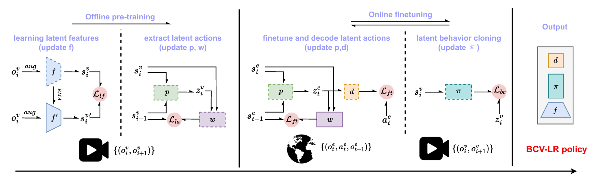

# Videos are Sample-Efficient Supervisions: Behavior Cloning from Videos via Latent Representations 





This repository provides the discrete implementation of BCV-LR. For continuous control, see [BCV-LR](https://github.com/liuxin0824/BCV-LR/).


## Data preparation
Download the procgen expert video data [here](https://drive.google.com/drive/folders/1XjpcfOm0NafPYFPnNtoHfhJ4nHVkQSB1) provided by lapo, unzip it, and place it in the expert_data directory. The expert_data dir should look like this:

```
expert_data
   --- starpilot
      --- train
      --- test
   --- bigfish
      --- train
      --- test
...
```

## Conda env

Enter the repository and use conda to create a environment.
```
cd BCV-LR-discrete

conda env create -f environment.yml
```

Use tmux to create a terminal (optional) and then enter the created conda environment:
```
tmux

conda activate BCV-LR
```


## Offline stage

To achieve offline pretraining on videos and obtain pre-trained models, run:

```
python run_offline.py
```

You will find the pre-trained models in the folder exp_results, like:

```
exp_results
   --- 20251206
      --- 213038starpilot
         --- model.pt......
...
```

## Online stage

revise the exp_name in the config.yaml to match the offline pre-trained models. For example, to run the starpilot experiments above, you should revise the exp_name to:
```
###config.yaml
exp_name: 20251206-213038starpilot
```

then you can run the online stage and see the results in wandb:
```
python run_online.py
```


## Citation


```
@inproceedings{
liu2025videos,
title={Videos are Sample-Efficient Supervisions: Behavior Cloning from Videos via Latent Representations},
author={Xin Liu and Haoran Li and Dongbin Zhao},
booktitle={The Thirty-ninth Annual Conference on Neural Information Processing Systems},
year={2025},
url={https://openreview.net/forum?id=cx1KfZerNY}
}
```

## Acknowledgement
The implementation and data are built on [LAPO](https://github.com/schmidtdominik/LAPO).
